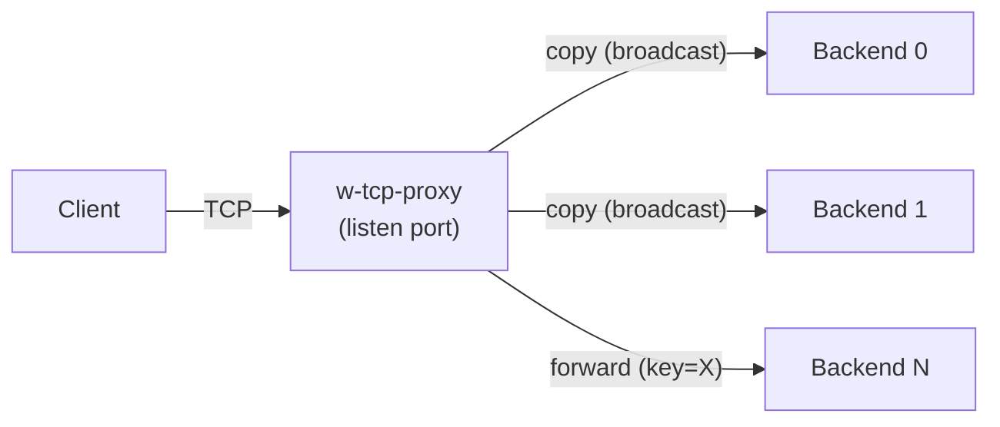

# w-tcp-proxy

A TCP proxy written in Go that uses **epoll** for high-performance I/O multiplexing. It supports content-based routing — you provide a custom split function that parses the raw TCP stream into tokens and returns a routing key, and the proxy forwards traffic to the appropriate backend(s) accordingly.

## Features

- **Epoll-based I/O** — efficient event-driven connection handling on Linux
- **Multiple backends** — configure any number of upstream servers
- **Two routing modes**:
  - `copy` — broadcast incoming data to **all** backends simultaneously (traffic mirroring)
  - `forward` — route incoming data to a **specific** backend based on a key
- **Custom protocol parsing** — implement a `SplitFunc` to parse any TCP-based protocol and extract a routing key from the byte stream
- **TOML configuration** — simple, readable config file
- **Structured logging** — console and file logging via [zap](https://github.com/uber-go/zap)

## How It Works



On each incoming connection, the proxy calls your `SplitFunc` to break the TCP stream into tokens and extract a **routing key**. The key is matched against the configured routes to decide which backend(s) receive the data.

## Quick Start

### 1. Write a `SplitFunc`

Implement `SplitFunc` to parse your protocol and return a routing key:

```go
func mySplit(data []byte, eof bool) (advance int, key, token []byte, err error) {
    // Parse data, extract a key that identifies the route
    key = []byte("key0")
    token = data
    return len(data), key, token, nil
}
```

### 2. Wire it up in `main.go`

```go
package main

import (
    "github.com/wiloon/w-tcp-proxy/config"
    "github.com/wiloon/w-tcp-proxy/proxy"
    "github.com/wiloon/w-tcp-proxy/utils"
    "github.com/wiloon/w-tcp-proxy/utils/logger"
)

func main() {
    config.Init()
    cfg := config.Instance
    logger.InitTo(cfg.Log.Console, cfg.Log.File, cfg.Log.FileLevel, cfg.Project.Name)

    p := proxy.NewProxy(cfg.Project.Port)
    p.Split(mySplit)

    route := proxy.InitRoute()
    p.BindRoute(route)
    p.Start()

    utils.WaitSignals(func() { logger.Infof("shutting down") })
}
```

See [example/w-tcp-proxy.go](example/w-tcp-proxy.go) for a complete working example.

### 3. Create a config file

Place `w-tcp-proxy.toml` next to the binary (or set the config path):

```toml
[Project]
Name = 'w-tcp-proxy'
Port = 2000

[Log]
Console = true
ConsoleLevel = 'debug'
File = true
FileLevel = 'info'

# Define upstream backend servers
[[Backends]]
Id = '0'
Address = '192.168.1.10:8080'
Default = true

[[Backends]]
Id = '1'
Address = '192.168.1.11:8080'
Default = false

# Route rules matched by the key returned from SplitFunc
[[Route]]
Key = 'key0'
Type = 'copy'        # broadcast to all backends

[[Route]]
Key = 'key1'
Type = 'forward'
BackendId = '1'      # forward only to backend '1'
```

See [example/config.toml](example/config.toml) and [example/config-0.toml](example/config-0.toml) for more examples.

## Requirements

- Linux (epoll is Linux-only)
- Go 1.18+

## Dependencies

| Package                            | Purpose                |
| ---------------------------------- | ---------------------- |
| `github.com/pelletier/go-toml/v2`  | TOML config parsing    |
| `go.uber.org/zap`                  | Structured logging     |
| `golang.org/x/sys`                 | Epoll syscall bindings |
| `gopkg.in/natefinch/lumberjack.v2` | Log file rotation      |
